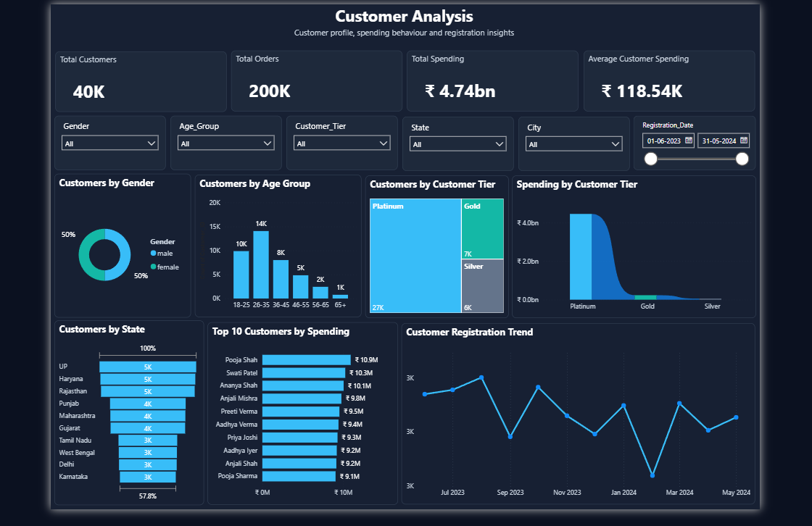
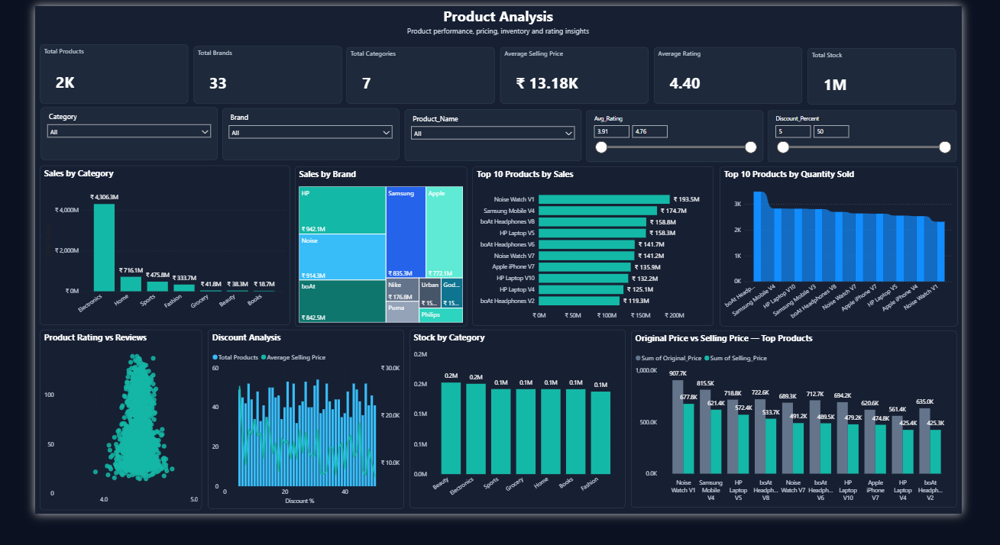
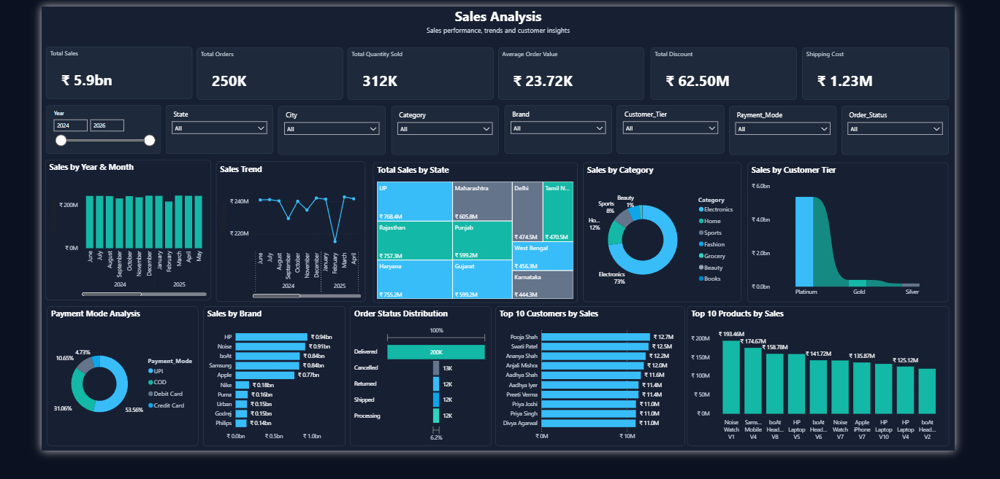

# E-Commerce Customer, Product & Sales Analytics

## Project Overview

This project analyzes e-commerce customer, product, and sales/order data using Power BI.

The objective is to understand customer behavior, product performance, sales trends, and overall business performance through interactive dashboards and data visualizations.

## Project Objectives

- Analyze customer demographics and spending behavior
- Identify high-value customer segments
- Analyze product and category performance
- Identify top-performing products and brands
- Analyze sales trends across time and locations
- Understand payment methods and order-status distribution
- Provide business insights through interactive Power BI dashboards

## Dataset

The project uses three main datasets:

- Customers - Customer details, demographics, registration information, and customer tier
- Products - Product details, categories, brands, pricing, discounts, ratings, and stock
- Sales / Orders - Order details, customers, products, dates, quantities, payment modes, and order status

## Data Model

The Power BI model follows a star-style structure.

Customers ─────── Sales ─────── Products
                      |
                      |
                  DateTable

### Relationships

- Customers[Customer_ID] → Sales[Customer_ID]
- Products[Product_ID] → Sales[Product_ID]
- DateTable[Date] → Sales[Order_Date]

A separate Date Table was created for year, month, month number, and time-based analysis.

## Tools & Technologies

- Power BI
- Microsoft Excel
- DAX
- Data Cleaning
- Data Analysis
- Data Visualization
- Power BI Data Modeling

# Customer Analysis

The Customer Analysis dashboard focuses on customer demographics, spending behavior, customer tiers, locations, and registration trends.

### Analysis Performed

- Customers by Gender
- Customers by Age Group
- Customers by Customer Tier
- Spending by Customer Tier
- Customers by State
- Top 10 Customers by Spending
- Customer Registration Trend

### Key Findings

- Platinum customers have the highest customer count and spending among the customer tiers.
- The 26–35 age group has the highest number of customers.
- Uttar Pradesh, Haryana, and Rajasthan have approximately 5K customers each.
- Pooja Shah is the highest-spending customer with approximately ₹10.9M in spending.



# Product Analysis

The Product Analysis dashboard evaluates product performance, pricing, ratings, discounts, brands, categories, and inventory.

### Analysis Performed

- Sales by Category
- Sales by Brand
- Top 10 Products by Sales
- Top 10 Products by Quantity Sold
- Product Rating Analysis
- Discount Analysis
- Stock by Category
- Original Price vs Selling Price

### Key Findings

- Electronics generates the highest sales at approximately ₹4.31B.
- HP, Noise, and boAt are among the strongest-performing brands by sales.
- Noise Watch V1 is the top product by sales at approximately ₹193.5M.
- Most product ratings are concentrated around 4.0–4.6.
- Low-stock products should be monitored to avoid stockouts.



# Sales Analysis

The Sales Analysis dashboard focuses on revenue trends, locations, categories, brands, customer tiers, payment modes, and order status.

### Analysis Performed

- Sales by Year and Month
- Sales Trend
- Sales by State
- Sales by Category
- Sales by Brand
- Sales by Customer Tier
- Payment Mode Analysis
- Order Status Distribution
- Top 10 Customers by Sales
- Top 10 Products by Sales

### Key Findings

- Uttar Pradesh generates the highest sales among the states shown, at approximately ₹768.35M.
- Electronics is the major contributor to overall sales.
- Platinum customers contribute the largest share of sales.
- UPI is the most-used payment method, accounting for approximately 53.6%.
- Delivered orders form the largest portion of the order-status distribution.
- Noise Watch V1 is the leading product by sales.



# Overall Business Insights

- Electronics is the major revenue-generating category.
- Platinum customers represent an important high-value customer segment.
- Customers aged 26–35 form the largest age group.
- UPI is the dominant payment method.
- Noise Watch V1 is one of the strongest-performing products.
- Uttar Pradesh is one of the leading states in both customer presence and sales.
- Top-performing products, brands, and customer segments can be considered for retention and targeted promotions.
- Low-stock and lower-performing products should be monitored for inventory and pricing decisions.

# Repository Structure

```text
Ecommerce-Customer-Product-Sales-analytics/
│
├── README.md
│
├── PowerBI/
│   └── Ecommerce_Analytics_Dashboard.pbix
│
├── Data/
│   ├── customers.csv
│   ├── products.csv
│   └── sales.csv
│
├── Dashboards/
│   ├── Customer_Analysis.png
│   ├── Product_Analysis.png
│   └── Sales_Analysis.png
│
└── Documentation/
    └── Key_Findings.png

# Project Outcome

The project provides an interactive reporting solution for analyzing customers, products, and sales performance. The dashboards allow users to filter data by different business dimensions and identify important patterns and trends for business analysis.
